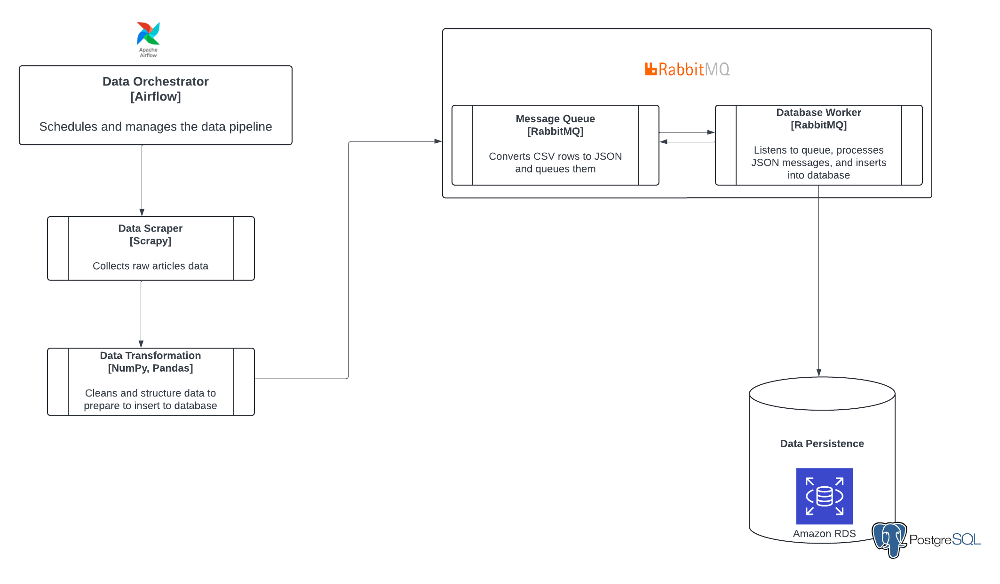

# airflow-dag-postgres-aws
Create an Airflow DAG to fetch article metadata from Medium, transform, and load into postgresql and deploy on AWS EC2 and RDS. Scripts for RabbitMQ available to fetch data as message queues and retrieve data with db worker/subscriber.

Tutorial Companion: <a href="https://www.joankusuma.com/post/build-an-airflow-dag-on-aws-ec2">Build an Airflow DAG on AWS EC2</a> 
<i>Tutorial companion for message queue will be coming soon</i>

# Architecture

 
 

# Tech Stack
* Language: Python
* Data Pipeline:
    - Task scheduler: Airflow
    - Data Extraction: Scrapy 
    - Data Transformation: Pandas, NumPy
    - Data Loading: Pscopg2, RabbitMQ for queue worker.
* Deployment:
    - Airflow is deployed on AWS EC2 with t3.medium
    - Postgres DB is deployed on AWS RDS Postgres

 

# Getting Started
Please follow the steps in the tutorial linked above for best practices, particularly for setting up Airflow. Also, pay close attention to the paths. Start by setting up Airflow first (outlined in more details in the tutorial article) and start the hello_world_dag before others.
 

# References
<a href="https://github.com/dougsgrott/medium_scraper/tree/master">Medium Scraper Repo by Doug Sgrott </a>
